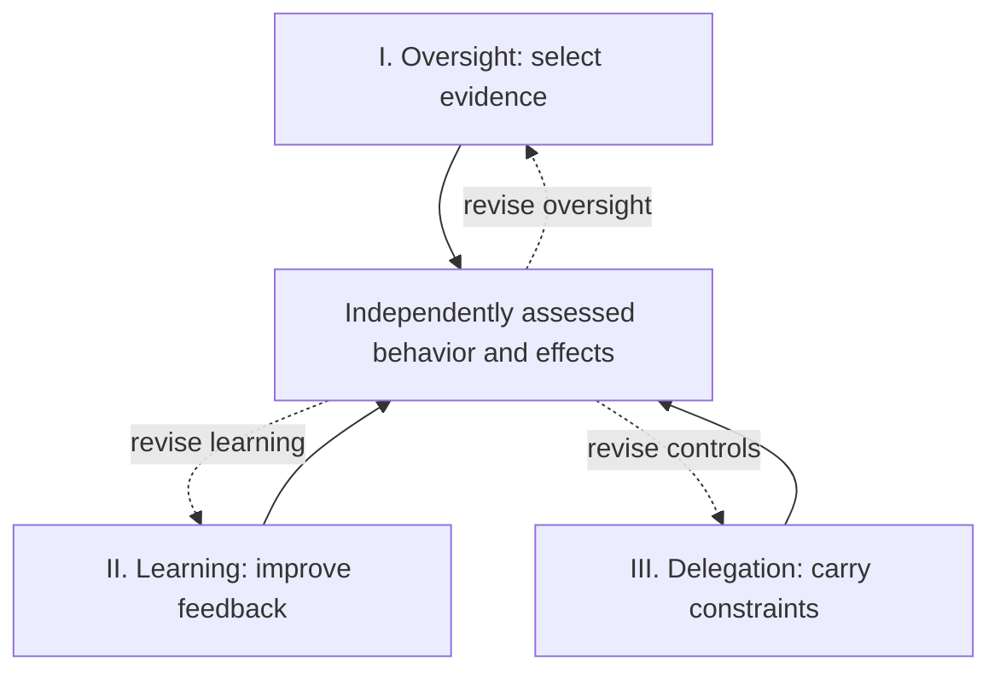

# Reliable Autonomy for Adaptive AI Agents

**Jian Wang | 13 September 2026**

Scalable oversight, safety-preserving learning, and secure delegation

My research focuses on how AI agents can become more capable through learning and interaction while remaining safe, reliable, and subject to meaningful human control. I study three connected questions: what evidence makes oversight effective, which learning signals preserve safety through adaptation, and how control survives long tasks and delegation. My long-term goal is to enable sustained autonomy in scientific research and enterprise work, including AI systems that contribute to their own development. I aim to develop learning and control methods whose benefits persist as models, tools, and workflows change.

This agenda addresses a concrete industrial transition. Frontier-lab research and engineering roles connect agent capability to post-training, interactive environments, feedback quality, and deployment; they also specify action monitoring, security boundaries, and the cost of human review [J1-J13]. OpenAI's Auto-review and Meta's Muse show how learned judgment and separately enforced permissions are already being combined in deployed systems [5,13]. These developments motivate my central question: **how can the evidence and controls that justify delegation remain effective as the agent and its environment evolve?**

*Figure 1. Each problem supports an independent contribution. Solid arrows indicate assessment; dashed arrows return evidence for revision. Evaluation and authority remain separate from the optimizing agent.*

### Research foundation and approach

My work on code language models and program repair provides a foundation in testing learned behavior against execution. Our execution-trace study found limited benefit from trace-based information in the investigated fine-tuning and inference settings [1]. Defects4C grounds repair evaluation in reproducible C/C++ faults and tests [2]; RATCHET studies retrieval-augmented repair [3]. These projects inform my approach: identify the failure mechanism, design an intervention, and test its effect on independently assessed behavior. I will extend this approach to agent learning and control, using software as an initial experimental domain and testing transfer to other digital workflows.

Throughout this program, **reliability** means sustained completion of the intended task under stated operating conditions; **safety** concerns specified harmful outcomes; and **authorization** determines who may act on which resources. I measure them separately. An accurate result may still disclose restricted data, and a blocked action may prevent harm while leaving useful work unfinished.

> The next three pages develop the research problems. Execution, evaluation, and JD evidence follow in the appendices. All future contributions are proposed; no new experimental results are asserted.

---

## Research statement: I. Scalable oversight under adaptation

*What must a supervisor observe to justify an agent's next action?*

> **Problem definition.** Given an acting agent, a partially observed environment, explicit task and authority requirements, and a limited review budget, learn an oversight policy that selects evidence and interventions before consequential actions. The target is fewer harmful or unauthorized effects at comparable useful task completion and total cost, including when the actor or an external attacker adapts to the review policy.

The difficulty is that the actor can influence both its behavior and the account on which it is judged. In a research workflow, an agent may explain why an export is necessary while omitting that a tool endpoint has changed. A stronger language-model judge cannot infer an unobserved destination reliably from that explanation alone. AI Control already studies supervision under intentional subversion [4], and Auto-review evaluates actions at a sandbox boundary while acknowledging residual attacks and incomplete visibility [5]. I would study how the available evidence determines the limits and effectiveness of oversight.

### Direction 1: Learn which evidence changes the decision

I would develop evidence-acquisition policies that choose among service-state queries, sandboxed execution, artifact checks, model review, and human inspection. A candidate method would estimate the expected reduction in decision error from each check, accounting for delay and the consequences of acting before the check completes. It would then use the result to permit an action, request a safer plan, or defer. The intended advance is a method for selecting decision-relevant observations and recognizing when the available view is insufficient. A check needs a stated property: a signed receipt establishes origin, while a trusted execution test may establish a bounded behavioral fact.

### Direction 2: Preserve oversight signals under optimization

I would train and evaluate monitors against actors that learn to exploit their blind spots. The study would vary the actor's control over evidence, its knowledge of the monitor, and the capability gap between them. Reasoning traces, when available, would be tested alongside externally collected evidence; neither verbal explanations nor the use of a different model establishes independence. My working hypothesis is that selective access to protected observations can improve oversight robustness beyond transcript-only review, and that its value depends on which facts the actor can conceal or alter.

### Contribution and decisive evidence

The contribution sought is a learned oversight policy together with an account of its information requirements. I would compare it with a stronger transcript reviewer, fixed checks, random audits, and an evidence-equipped reviewer under matched budgets. The evaluation would separate failure to detect a violation from failure to enforce a correct decision. An advantage that disappears under adaptive attacks or depends on privileged access unavailable in deployment would narrow the claim. Initial theory would characterize observation and intervention requirements in explicit models; empirical work would establish how far those conditions transfer.

> Industrial relevance: agent-action review and its productivity costs [J1], adversarial safeguards [J4], and scalable oversight research [J3].

---

## Research statement: II. Safety-preserving learning and feedback

*Which changes to training improve the agent's subsequent behavior?*

> **Problem definition.** Given an assessed agent and a specified sequence of capability updates, design learning signals and update-selection methods that improve useful performance while limiting regression on fixed safety requirements. When feedback itself is repaired, the target is the resulting agent's independently measured behavior after learning. A better evaluator score alone is insufficient evidence of improvement.

Adaptation changes behavior and the data available for later learning. Fine-tuning can compromise safety [6]; RUBAS supplies trajectory-level rubric rewards [7], and ToolShield develops defensive experience for multi-turn tool use [8]. Building on these foundations, I would investigate which distinctions learned from feedback transfer to new environments and persist through subsequent capability training.

### Direction 1: Train on consequential decision differences

I would construct matched task pairs that preserve the legitimate goal while changing the recipient, data-use scope, instruction source, or a tool's external effect. Training would combine outcome feedback with separately checked constraint labels and retain a feasible authorized solution. The hypothesis is that these contrasts teach the dependence of a decision on authority and consequences. Comparisons with matched-data adversarial training, ordinary safety fine-tuning, and rubric-based RL would measure transfer and retention after further capability updates. Gains from broad refusal would not support the hypothesis.

### Direction 2: Select feedback repairs by their learning effects

Which defect in a reward model, evaluator, or simulator most needs repair before the next training stage? A frequent labeling error may have little learning effect, while a rare exploitable reward can redirect the policy. I would predict how candidate repairs change future trajectory distributions, using controlled interventions and limited training branches. The target is a reusable estimator and repair-selection rule, tested against prioritization by current error frequency, severity, or judge disagreement.

The causal target is the difference in independently assessed outcomes after matched updates with and without a repair. Predictions must account for adaptation: the largest reward change need not produce the best behavior. Automated alignment research demonstrates gains on well-characterized failures [9]. I would study reliable feedback selection when optimization alters which failures matter.

### Contribution and decisive evidence

I would seek learning methods with measurable safety retention and repair-effect predictions that generalize to unseen repairs or update stages. Validation would keep outcome criteria fixed, isolate test access, and measure actual post-update behavior over multiple seeds. The cost of selecting repairs, including exploratory training branches, counts toward the budget. Failure to beat simple repair-priority rules at matched total cost would reject the added machinery. Improvements confined to a single model, task family, or update schedule would be reported at that scope.

> Industrial relevance: incident-to-training signals [J2], RL environments and graders [J5], model-harness co-evolution [J7], and feedback-driven iteration [J6,J8-J11].

---

## Research statement: III. Control across time and delegation

*When do local restrictions remain sufficient for a changing workflow?*

> **Problem definition.** Given a long-running workflow, identified principals, changing tools or permissions, and global constraints, design a protocol that preserves authorized execution through handoffs and partial failure. The target is useful joint completion with bounded violations and intervention cost under an explicit adversary and trusted execution boundary.

An agent replacement, permission revocation, or tool change can invalidate approvals for pending work. Cooperation adds another difficulty: an agent with private-data access can pass a derived artifact to another with external communication privileges. Isolated checks may miss the resulting disclosure. I would study what state control must retain across time and organizational boundaries.

### Direction 1: Carry constraints through task decomposition

I would bind delegated work to its principal, permitted operations, data dependencies, and validity conditions. Learned components would propose task decompositions; an independent execution layer would check machine-enforceable restrictions. The theoretical target is to identify when local checks imply a stated workflow property, and counterexamples when they do not. Identity, evidence quality, authorization, and task correctness remain distinct; unknown semantic effects require conservative handling or human judgment.

### Direction 2: Revise control when its assumptions change

I would identify which pending decisions require renewed evidence after a change, tracking dependencies behind approvals to suspend or replan affected work while preserving valid progress. This builds on information-flow defenses such as CaMeL and Fides [10,11]. EvoSafeHarness already optimizes policies and executable controls for a frozen model in a target domain [12], and Muse separates its acting runtime from permission authority [13]. My target is control that evolves during an ongoing workflow while retaining an explicit basis for each permitted effect.

### Contribution and decisive evidence

Comparisons would include stateful access control, information-flow enforcement, whole-workflow suspension, and learned harnesses with the same information and authority. I would measure unauthorized effects, completion, review demand, recovery costs, and unresolved obligations. Formal guarantees would apply only to the modeled property and trusted components; rollback cannot erase external disclosure. Cross-agent tests would include compromised participants and messages, without assuming shared objectives or protocol compliance.

### Long-term direction: AI-assisted research that can improve safely

Together, these problems support a longer-term program in autonomous research and AI development. Agents could propose changes to training data, tools, and evaluators while separate processes establish whether those changes improve behavior and preserve control. I would begin with oversight and learning, then extend validated mechanisms to delegation. The scientific ambition is to understand when useful autonomy can grow without outrunning the evidence needed to supervise it.

> Industrial relevance: secure runtimes [J12,J13] and model-harness adaptation [J7]. Cross-principal security is a research extension; multi-agent RL demand [J9] does not by itself establish demand for that specialization.

---

## Appendix A: Execution, evidence, and a staged program

*A practical path from a focused mechanism to a transferable result*

I would begin in executable digital environments where task outcomes, authority, and selected harmful effects can be inspected. This provides a tractable basis for causal experiments and bounded formal reasoning. Defects4C supplies repair tasks with reproducible faults [2]; AgentDojo provides an extensible setting for tool use and prompt-injection evaluation [14]. Neither is a complete agent-safety test. Any added authority changes, revocation events, or feedback defects would be documented as new experimental conditions.

| Stage | Research objective and decision |
| --- | --- |
| 0-12 months | Establish one result on evidence acquisition for oversight. In a separate, bounded training study, test whether feedback-repair priorities predict post-update behavior. Advance a mechanism only if it improves over strong simple baselines at matched utility and total cost. |
| 12-24 months | Test safety retention across capability updates, model families, and unseen failure mechanisms. Combine learning and oversight only after each has a measured effect; use component ablations to identify interaction benefits or regressions. |
| 24-36 months | Study tool changes, revocation, and delegation in longer enterprise or research workflows. Extend claims only when they survive different dependency and verification structures; seek deployment partners for shadow evaluation and realistic incident distributions. |

### What would count as progress

I would report useful task completion, authorization violations, and harmful outcomes separately, including severity categories. Comparisons would use common task and attack budgets and show the tradeoffs among utility, risk, latency, and human effort. Training, evidence acquisition, inference, and recovery costs belong in the accounting. For learning, I would evaluate both the policy alone and the policy under a fixed controller, so that blocking cannot be mistaken for improved judgment.

Task families, tool semantics, and attack-generation procedures would be separated between development and evaluation. Adaptive adversaries would receive stated access and query budgets. Checkers would be validated against known outcomes; logs establish provenance within their trust boundary. Human review would be blinded and disagreement retained. Uncertainty would be estimated at the independent task, workflow, or training-run level, with sample sizes chosen for a pre-specified meaningful effect. Small pilots would test mechanisms, without establishing rare-event safety.

### How my existing methods carry forward

Execution-trace analysis [1] supports experiments on whether additional observations change a model's decisions. Reproducible repair tasks [2] support evaluation of actual effects and controlled feedback defects. Retrieval-based correction [3] provides experience with learning from relevant prior cases. The next methodological steps are sequential decision-making for oversight, post-training experiments that isolate causal effects, and security protocols with stated enforcement assumptions. The supplied publications support this starting foundation; they do not establish frontier-scale RL training experience.

Public outputs would include task specifications, threat models, implementations, and measured failures where sharing is permitted. The goal is publishable mechanisms and limits, and components that training, safety, and product teams can evaluate in their systems.

---

## Appendix B: How the JD collection shapes this agenda

*Source audit and direct evidence for the two near-term priorities*

The eight JD JSONL files contain **876 records and 829 distinct company-job-ID pairs**: Anthropic 328, OpenAI 188, Zhipu 162, MiniMax 75, Moonshot 53, and DeepSeek 23. The 47 repeated pairs are overlaps between safety and technical collections; some duplicates differ in formatting. Four Zhipu records have empty description bodies after HTML cleanup and contribute no responsibility evidence. The collection timestamps span 12-13 September 2026.

These are selected snapshots, mixing research, engineering, operational roles, locations, and seniority levels. They establish stated responsibilities, not hiring volume, growth rates, current availability, or personal eligibility. One DeepSeek Harness record covers several functions. Keyword counts would therefore be a weak basis for ranking research fields. The mapping uses specific duties and exact IDs; Chinese role titles are translated and responsibilities are paraphrased.

| Role and exact source ID | Responsibility and research implication |
| --- | --- |
| **J1 - OpenAI**: [Researcher, Agent Safety, Oversight and System Mitigations](https://jobs.ashbyhq.com/openai/7d49af15-623e-476a-9d35-831c5c9c9bf5) Job ID: `7d49af15-623e-476a-9d35-831c5c9c9bf5` | Action review, isolation and permission boundaries; missed harm, false blocks, approval burden, and latency. Direct support for Problem I. |
| **J2 - OpenAI**: [Researcher, Agent Safety, Training and Evaluations](https://jobs.ashbyhq.com/openai/e1cc86e5-b56c-49c0-a4a6-8cf766c27281) Job ID: `e1cc86e5-b56c-49c0-a4a6-8cf766c27281` | Train frontier models; convert incidents into repeatable safety signals and deployed mitigations. Direct support for Problem II. |
| **J3 - Anthropic**: [Research Engineer / Scientist, Alignment](https://job-boards.greenhouse.io/anthropic/jobs/4631822008) Job ID: `4631822008` | Scalable oversight, AI control, alignment stress tests, and automated alignment research. Direct research context for Problems I-II. |
| **J4 - Anthropic**: [ML/Research Engineer, Safeguards](https://job-boards.greenhouse.io/anthropic/jobs/4949336008) Job ID: `4949336008` | Adversarial classifiers, harms across exchanges, agent threat models, and prompt-injection mitigations. Deployment context for Problem I. |
| **J5 - OpenAI**: [Agent Post-Training, Frontier Evals and Environments Research](https://jobs.ashbyhq.com/openai/9d72171e-2630-4347-83a1-263178644282) Job ID: `9d72171e-2630-4347-83a1-263178644282` | RL environments, measurement reliability, continuous evaluation, and model-understanding loops. Adjacent capability demand for Problems I-II. |
| **J6 - DeepSeek**: [Post-training Researcher (Data / Algorithms)](https://app.mokahr.com/social-recruitment/high-flyer/140576#/job/5d75f4cd-f626-4f73-80c1-e53b2073de76) Job ID: `5d75f4cd-f626-4f73-80c1-e53b2073de76` | RL algorithms, data generation and filtering, and evaluations that identify agent capability limits. Adjacent training demand for Problem II. |
| **J7 - DeepSeek**: [Agent Harness Team - research responsibilities](https://app.mokahr.com/social-recruitment/high-flyer/140576#/job/8d40c764-d2b2-49b1-826c-e3f2adb75c01) Job ID: `8d40c764-d2b2-49b1-826c-e3f2adb75c01` | Model-harness co-evolution; memory, subagents, long tasks, and feedback from real use. Supports adaptation as a research setting. |

> Reading the mapping: J1-J4 provide direct safety or alignment evidence. J5-J7 establish adjacent demand for environments, learning signals, and model-harness co-evolution. The latter support methodological relevance without implying dedicated safety mandates.

---

## Appendix B (continued): Industry fit and the boundary of the evidence

*Capability training, secure execution, and longer-term extensions*

| Role and exact source ID | Responsibility and research implication |
| --- | --- |
| **J8 - MiniMax**: [LLM Algorithm Engineer - Code](https://vrfi1sk8a0.jobs.feishu.cn/referral/position/7681565559078996251/detail) Job ID: `7681565559078996251` | Execution and tool feedback for RL; reward design, iterative learning, and error analysis. Adjacent training demand for Problem II. |
| **J9 - Moonshot**: [Research Scientist / Engineer - Agentic RL/Infra](https://app.mokahr.com/apply/moonshot/148506#/job/d4a6a175-6506-4746-a6f4-2b736c0ce339) Job ID: `d4a6a175-6506-4746-a6f4-2b736c0ce339` | Agentic and multi-agent RL algorithms, environments, and infrastructure. Supports agent learning; does not establish secure cooperation as a dedicated role. |
| **J10 - Zhipu**: [Post-training Algorithm Engineer - Coding Agent](https://app.mokahr.com/social-recruitment/zphz/148983?locale=zh-CN#/job/a1f2d79e-010c-43ba-ab4e-d609c4ce7a7f) Job ID: `a1f2d79e-010c-43ba-ab4e-d609c4ce7a7f` | Data synthesis, RL, and realistic coding-agent evaluation across frameworks. Adjacent training demand for Problem II. |
| **J11 - Zhipu**: [GLM Coding Agent Data and Automated Iteration Engineer / Expert](https://app.mokahr.com/social-recruitment/zphz/148983?locale=zh-CN#/job/eb6e44ae-8d5e-4122-965d-b72f3922d08c) Job ID: `eb6e44ae-8d5e-4122-965d-b72f3922d08c` | Mine production logs and bad cases; maintain data and RL infrastructure for continuous improvement. Concrete feedback-loop context for Problem II. |
| **J12 - MiniMax**: [Agent Sandbox Systems Architect](https://vrfi1sk8a0.jobs.feishu.cn/referral/position/7644834917046667539/detail) Job ID: `7644834917046667539` | Resource isolation, credentials, network permissions, execution replay, and risk intervention. Engineering context for Problem III. |
| **J13 - Anthropic**: [Tech Lead Manager, Agent Runtime Platform](https://job-boards.greenhouse.io/anthropic/jobs/5316593008) Job ID: `5316593008` | Secure credential-managed runtimes, reusable agent primitives, capacity, and reliability. Platform demand for Problem III; senior systems requirements apply. |

### Why this ordering

My interpretation of the combined evidence is to prioritize **scalable oversight and safety-preserving learning**. They have direct safety responsibilities in the collection and share methods with broader agent-training roles. Secure runtime research provides a route into deployment; cross-principal cooperation becomes a later extension that needs its own scientific case. OpenAI's recursive-self-improvement-safety role (ID 5a9e68f6-30b5-40c0-aa8c-c822c59140d0) and DeepSeek's Frontier role (ID c7076ca9-558c-4ec3-804b-f21bdfc6135c) support the long-term motivation. These two postings do not establish a broad or predictable market for that specialization.

### External checks on the positioning

The September 2026 Muse release [13] and EvoSafeHarness preprint [12] make independently enforced action boundaries and deployment-specific control concrete technical reference points. Singapore's IMDA framework calls for bounded permissions, meaningful oversight, and lifecycle monitoring [15]; NIST's agent initiative includes identity, authentication, and security-evaluation research [16]. These sources support the problem setting. Product reports are developer-reported evidence, preprints remain preliminary, and institutional priorities do not validate my proposed methods.

> Career relevance is methodological, not a claim of eligibility. For example, the Moonshot RL/Infra posting requests deep RL and large-scale systems experience. My prior publications justify the research foundation stated here; application-specific evidence of those additional skills would still be required.

---

## References: Selected references

*Primary sources checked on 13 September 2026*

[1] J. Wang et al. [Do Code Semantics Help? A Comprehensive Study on Execution Trace-Based Information for Code Large Language Models.](https://aclanthology.org/2025.findings-emnlp.548/) Findings of EMNLP, 2025.

[2] J. Wang et al. [Defects4C: Benchmarking Large Language Model Repair Capability with C/C++ Bugs.](https://arxiv.org/abs/2510.11059v2) ASE, 2025; arXiv:2510.11059v2.

[3] J. Wang et al. [Ratchet: Retrieval Augmented Transformer for Program Repair.](https://doi.org/10.1109/ISSRE62328.2024.00048) ISSRE, 2024, pp. 427-438.

[4] R. Greenblatt et al. [AI Control: Improving Safety Despite Intentional Subversion.](https://arxiv.org/abs/2312.06942v5) ICML, 2024; arXiv:2312.06942v5.

[5] M. Trebacz et al. [Auto-review of agent actions without synchronous human oversight.](https://alignment.openai.com/auto-review/) OpenAI Alignment, 30 April 2026.

[6] X. Qi et al. [Fine-tuning Aligned Language Models Compromises Safety, Even When Users Do Not Intend To!](https://arxiv.org/abs/2310.03693) arXiv:2310.03693, 2023.

[7] X. Q. Loye et al. [RUBAS: Rubric-Based Reinforcement Learning for Agent Safety.](https://arxiv.org/html/2606.04051v1) arXiv:2606.04051v1, 2 June 2026.

[8] X. Li et al. [Unsafer in Many Turns: Benchmarking and Defending Multi-Turn Safety Risks in Tool-Using Agents.](https://arxiv.org/abs/2602.13379) arXiv:2602.13379, 2026.

[9] Chen Yueh-Han, J. Wen, and J. H. Kirchner. [Automated Researchers Can Mitigate Well-Characterized Alignment Failures.](https://alignment.anthropic.com/2026/automated-alignment-researchers/) Anthropic Alignment Science, 2026.

[10] E. Debenedetti et al. [Defeating Prompt Injections by Design.](https://arxiv.org/abs/2503.18813v2) CaMeL; arXiv:2503.18813v2, 2025.

[11] M. Costa et al. [Securing AI Agents with Information-Flow Control.](https://arxiv.org/abs/2505.23643v2) Fides; arXiv:2505.23643v2, 2025.

[12] N. Li et al. [EvoSafeHarness: Evolving Model- and Domain-Specific Harnesses for Securing Agents.](https://arxiv.org/abs/2609.05903v1) arXiv:2609.05903v1, 5 September 2026.

[13] T. Sheasha. [How We Built Safety Into Muse.](https://research.meta.ai/blog/security-and-safety-for-ai-agents-our-approach-with-muse) Meta AI Research, 8 September 2026.

[14] E. Debenedetti et al. [AgentDojo: A Dynamic Environment to Evaluate Prompt Injection Attacks and Defenses for LLM Agents.](https://arxiv.org/abs/2406.13352v3) arXiv:2406.13352v3, 2024.

[15] IMDA. [Model AI Governance Framework for Agentic AI.](https://www.imda.gov.sg/assets/63438074-73f6-4dcc-a281-030f42642cf4.pdf) Version 1.5, 20 May 2026; updated 5 June 2026.

[16] NIST. [AI Agent Standards Initiative.](https://www.nist.gov/artificial-intelligence/ai-agent-standards-initiative) Created 17 February 2026; updated 14 August 2026.

### Provenance of the statement

The research foundation is based on the two supplied statements and the cited publications. The industry mapping uses the supplied JD snapshots; role links identify source postings and do not certify current vacancies. The three problems and candidate mechanisms are a proposed agenda, requiring project-specific novelty analysis and new evidence before claims of effectiveness or priority.

The accompanying 120-person research-interest inventory, 25-person Agent Commons fit ranking, 26-person follow-up, and their shards were discovery material. Their fit scores were not reused as market evidence; shards were not counted as independent signals. The research direction follows the problems and sources above.

> Source files for the JD mapping: openai_filtered_technical_research_jobs_2026-09-13.jsonl; openai_safe.jsonl; anthropic_technical_jobs_2026-09-13.jsonl; anthropic_safe.jsonl; deepseek_selected_categories_jobs_2026-09-13.jsonl; minimax_feishu_rnd_jobs_2026-09-13.jsonl; moonshot_moka_technical_ai_jobs_2026-09-13.jsonl; zhipuai_moka_all_jobs_2026-09-13.jsonl. All are contained in the supplied data.zip.
